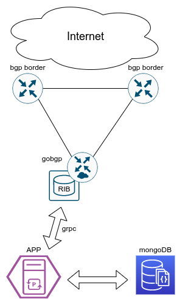
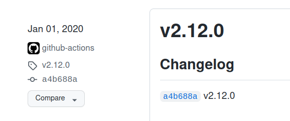

# SDBGP - приложение для управления BGP маршрутами в RIB GoBGP  
## Goal 
Задача - фильтровать от внешних атак с известных префиксов. Префиксов многие тысячи. емкость ACL на маршрутизаторах недостаточна, да и неудобно когда маршрутизаторов больше 2-х.  
Решение - анонсировать такие префиксы маршрутизаторам по BGP с помощью отдельного рутсервера  
Так же полезно включить URPF для того, чтобы маршрутизатор блокировал пакеты на входящих интерфейсах

Схема решения:  


В качестве рутсервера выступает демон **goBgp**.  
Для удобства управления префиксами используется промежуточная база данных реализованная на движке **Mongo**. Приложение общается с демоном по протоколу **gRPC**

[Пример использования приложения в среде docker](docs/lab1.md)

## Prerequisits
Нам потребуется следующие компоненты:
  1. GoBGP - собственно bgp демон
  2. MongoDB - промежуточное хранение префиксов
  3. Python3 - бекенд приложения
  4. React - фронтенд приложения

### GoBGP 
GoBGP должен быть установлен и доведен до рабочего сотстояния.  
Есть в стандартных линукс дистрибутивах, на гитхабе, докерхабе итд.  
Для **ubuntu** достаточно такого  
```bash
$ sudo apt install gobgpd
$ cat /etc/gobgpd.conf 
[global.config]
  as = 65100
  router-id = "192.168.255.1"
$ sudo systemctl start gobgpd
```

Приложение использует **protobuf** файлы, которые могут отличаться в разных версиях **goBgp**

поэтому необходимо получить протобуфы именно для нашей версии

Делается это следующим образом  
1. выяснить текущую установленную версию **goBgp**
    > $ gobgp --version  
gobgp version 2.12.0

2. Зайти в [gobgp репозиторий](https://github.com/osrg/gobgp/releases) найти там подходящий релиз и получить хеш релиза (*a4b688a*)  
     
   
3. склонировать репозитарий
    > $ git clone https://github.com/osrg/gobgp.git gobgp_repo
4. перейти в репозитарий и получить слепок релиза
    > $ cd gobgp_repo    
    > $ git checkout a4b688a
5. скопировать *proto файлы в рабочий каталог
    > $ cd ..  
    > $ cp gobgp_repo/api/*proto .  
6. из полученных **protobuf** файлов сгенерировать **python**-библиотеки
    > $ python3 -m grpc_tools.protoc -I. --python_out=. --grpc_python_out=. *.proto  

7. убедиться что появились/обновились файлы ***.py** соответствующие по названиям файлам ***.proto**:
   > gobgp_pb2.py, gobgp_grpc_pb2.py, attribute_pb2.py, attribute_pb2_grpc.py
   ***.proto** файлы нам болбше не понадобятся

### Mongo
    > apt install mongo //или как то так
Я не сильно знаком с монго, возможно, нужно заранее зайти и обозначить используемую в проекте базу данных **sdbgp**

    > $ mongo  
    > use sdbgp  
    > exit  

### Python
Бекенд реализован на FastAPI, и использует ряд модулей для работы с mongo и grpc  
Окружение создается как обычно:  

    > $ python3 -m venv venv  
    > $ source venv/bin/activate  
    > $ pip3 install -r requirements.txt  
    > $ uvicorn routes:app [--options]  


### React
    > $ cd frontend
    > $ npm install
    > $ npm start
