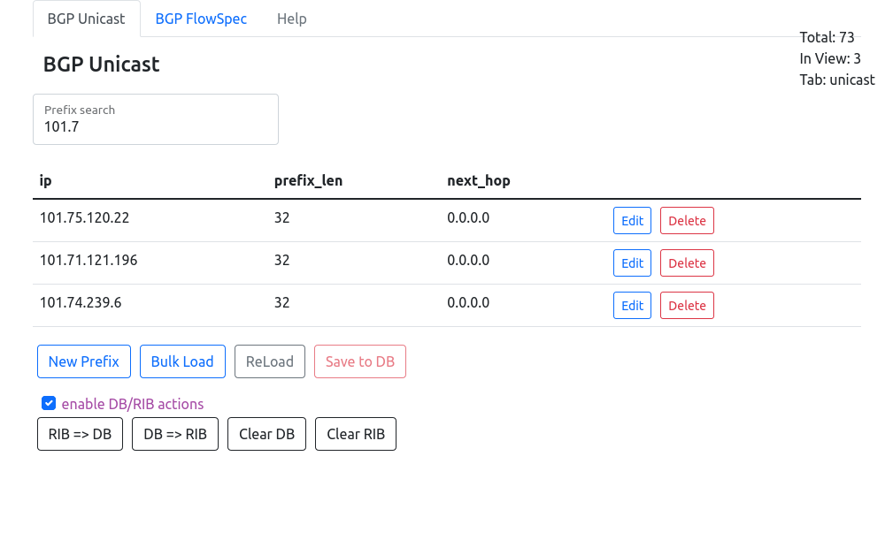
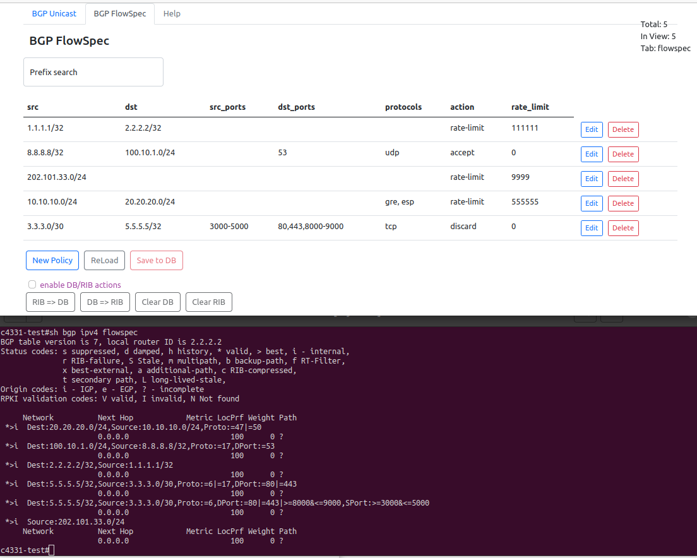

# SDBGP - app to manage BGP prefixes within the GoBGP RIB

## Purpose: 

Hi. this application is designed to prevent and mitigate DDoS attacks

I have a couple of BGP routers in my site facing the internet.
And, of course, I'm a little worried about what to do if I'm attacked.

I don't care too much about ddos though
the main reason i do this is i think this app is a good idea to master some skills (junior level) to be not only a network engineer but also a software developer ;)

## Solution: 

this application is designed to prevent and mitigate DDoS attacks using two methods:  
1. rfc5635 - Remote Triggered Black Hole Filtering with Unicast Reverse Path Forwarding (uRPF)  
2. rfc5575 - BGP Flow Spec 

Both methods rely on some intermediate controller that adverises politics to the edge routers.  
The app is that controller. It is a web application with a simple user interface that helps you manage routes and policies and manages the gobgp daemon. The daemon then speaks to our BGP routers advertising politics we have made on a the controller

the image below illustrates how it works


the central point is gobgp daemon. App speaks to the daemon by means of grpc protocol and then the daemon speaks to bgp neighbors with the old good BGP proto.  

So as I mentioned above two methods have been implemented. Let's describe them in more detail

## 1. Unicast prefixes + uRPF (S/RTBH)

The Source Remote Triggered Blackhole (S/RTBH) solution is a legacy variant DDoS mitigation that was specified in RFC 5635
http://tools.ietf.org/html/rfc5635

To prevent a future attack we must prepare our network by putting a static discard route for each of our edge routers as well as unicast Remote Path Forwarding (uRPF) on each of their interfaces before an attack takes place.  
In case of attack, we somehow have to figure out the original prefixes from which the attack is performed, and place these prefixes in the router database (RIB)

In the modern world, DDOS attacks became more predictable
Because most attacks are caused by political disagreements and not commercial issues. Such attacks are more likely on the one hand, but on the other hand they are more fragmented and cause less damage than those that destined to a particular service. And what is more important we can prepare for these attacks by filtering out entire internet segments in advance. I mean if we are trying to secure some domestic internet service that was never intended to serve international customers or customers from a specific part of the world. For that type of protection we can create a list of such prefixes much in advance

So the app does provide the convinient way to place prefixes into routers RIB. For the S/RTBH case prefixes have only one atribute - the nexthop. That is the very nexthop address that must be discarded on the edge routers (edge means facing to the internet)

The app's tab destined to that type of mitigation looks like this 


## 2. FlowSpec

S/RTBH method is pretty simple and it is working but it isn't flexible enough. Modern routers support the more advanced technic - the BGP FlowSpec. FlowSpec provides the possibility to filter out flows based on 5-tuple and/or Layer4 information and besides that it has the advanced filtering action like rate-linit or forwarding to another VRF (for inspection)

*Note* it has some limits. My Cisco 4431 routers have limited capacity of 4000 flowspec politics. Not bad though but if you for whatever reason need more politics you have to deal with the first option

BTW in the beginning I was not going to implement this feature but why not. the goBgp daemon supports FlowSpec perfectly and my routers do and it was looking pretty interesting

the apps flowspec tab looks like this


here you can see the app's screen and the router console below that that shows the data between app and a router is consistent

## Deployment

there two option to deploy the app:
1. Deploy all the components yourself
2. Use docker-compose

Here we consider the first option and the second option is devoted to a separate article [Deploy with docker](docs/DEPLOY%20with%20docker.md) 

The App uses the following components

  1. GoBGP - choosen bgp daemon
  2. MongoDB - intermediate states
  3. Python3 - backend of the app
  4. React - frontend of the app

### GoBGP 

before the app deployment GoBGP have to be installed and running  

for my Ubuntu 20.04 it's pretty easy and straightforward
```bash sudo apt install gobgpd
$ sudo apt install gobgpd
$ cat /etc/gobgpd.conf 
[global.config]
  as = 65100
  router-id = "192.168.255.1"
$ sudo systemctl start gobgpd
```
and besides that for our app to communicate with gobgp via grpc we need protobuf files.  
Different gobgp version may come with different protobufs
The repo has protobufs included for gobgp version 2.12 and I've tested these protobufs with the gobgp version 2.34 and it was worked.
So probably you can skip this step if you are using gobgp version 2.x

### Getting protobufs quest
1. figure out gobgp version
> \> gobgp --version  
gobgp version 2.12.0

2. go to the [github gobgp repo](https://github.com/osrg/gobgp/releases) find the release for your gobgp version and copy the release's hash (*a4b688a*)  
     

3. clone the repo
    > $ git clone https://github.com/osrg/gobgp.git gobgp_repo
4. cd to repo and checkout to the release by the hash
    > $ cd gobgp_repo    
    > $ git checkout a4b688a
5. copy *proto files from the gobgp_repo/api/ into the app repo dir backend/gobgp/ and cd to that destination
    > $ cp api/*proto sdbgp_repo/backend/gobgp/
    > $ cd !$  
6. generate python libs from the protobufs 
    > $ python3 -m grpc_tools.protoc -I. --python_out=. --grpc_python_out=. *.proto  

7. make sure **.py** files with the corrsponding names of ***.proto** files appeared:
   > gobgp_pb2.py, gobgp_grpc_pb2.py, attribute_pb2.py, attribute_pb2_grpc.py

a little tedios I know :)


### Mongo
    > apt install mongo //or something like that

### Python
backend uses the brilliant (kudo to Sebastian Ramires) FastAPI framework along with some additional libraries to work with mongo and grpc

the virtual environment is being created the traditional way
    > $ cd backend
    > $ python3 -m venv venv  
    > $ source venv/bin/activate  
    > $ pip3 install -r requirements.txt  

next copy *config.py.example* into *config.py*  
and probably it make sense to get inside *config.py* and edit some options

    > cp config.py.example config.py

now you ready to go

    > $ uvicorn routes:app


### React
    > $ cd frontend
    > $ npm install

frontend has its own config file *src/config.js*  
but it's unlikely you have to edit it so go ahead an run the frontend

    > $ npm start

some magic is going on and finally the browser will start a new window (or tab) with the app inside

Now try to add some prefixes by clicking on **NewPrefix** button, then save new prefixes into the DB (**Save to DB**) and push them into gobgp daemon by clicking on **DB => RIB** button

you can check the gobgp RIB with the following CLI commands:
> \> gobgp global rib  
> \> gobgp global rib -a ipv4-flowspec

Also you can add prefixes or flowspec policies directly into gobgp with the follwong CLI commands:
> \> gobgp global rib add 1.2.3.56/32 nexthop 0.0.0.0
> \> gobgp global rib -a ipv4-flowspec add match source 3.3.3.3/30 destination 5.5.5.5/32 protocol '==tcp&==udp' destination-port '80,443' then discard

Learn more gobgp CLI command [CLI tutor goBGP](https://github.com/osrg/gobgp/blob/master/docs/sources/cli-command-syntax.md#1-global-subcommand)

 


