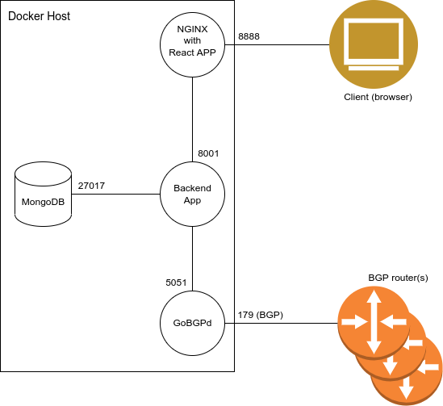

# Deploing the app with docker-compose

docker is the most convinient way to deploy the app

the following schema shows the app consists of 4 containers 

and thanks for docker compose the deployment of this app is simple as one two three

## one

fetch the repo and cd into
> \> git clone github_url  
> \> cd sdbgp  

## two 

make a little preconfiguration by copying the backend's configuration file config.py.example and edit it accordingly
> \> cp backend/config.py.example backend/config.py  
> \> vim backend/config.py  

## three

edit the **REACT_APP_API_BASE_PATH** variable within the .env file.  
It should be the server name you are deploying the app on

and run docker compose by typing 
> \> docker-compose up

and that's it  
wait a bit while docker-compose extracts all the necessary pip and npm modules and builds the frontend. eventually the app will be built and run and you can start using it
