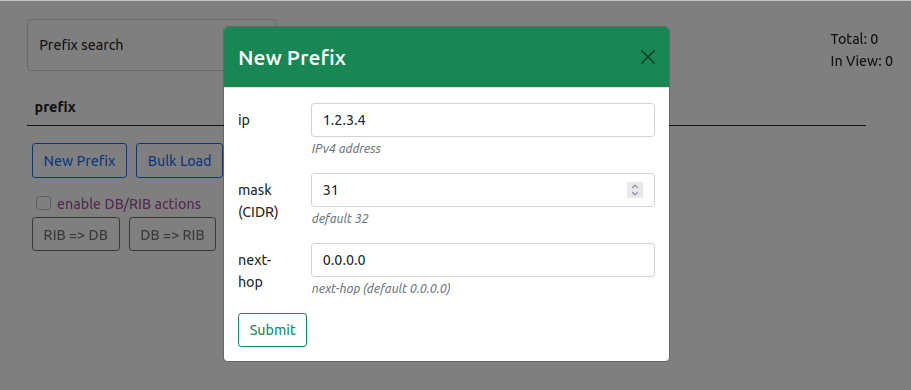
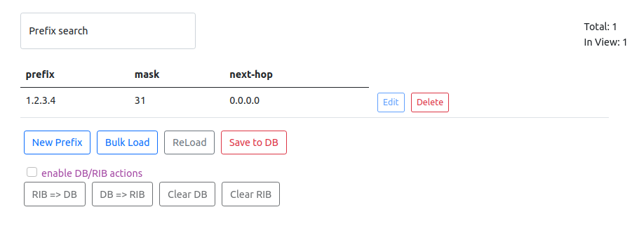

# Labbing #1 (conternerized gobgp + frr)

**docker** is the most coninient way to play with the app on a locahost  


first lets create two networks: **net1** and **net2**  
```bash
  > $ docker network create net1 --subnet=172.21.0.0/16
  > $ docker network create net2 --subnet=172.22.0.0/16
```
then we'll install two docker images:  
```bash
   > $ docker pull frrouting/frr
   > $ docker pull jauderho/gobgp:v2.34.0  
```
## running frr container

first create and run the frr container:  
```bash
  > $ run -dit --name frr1 --hostname frr1 --privileged --net net2 frrouting/frr
```
now dive in the container and configure it from within:  
```
> $ docker exec -it frr1 /bin/sh
> # cd /etc/frr
> # vim daemons
```
here we just need to find ***bgpd=no*** and change it to ***bgpd=yes***

```
> # vim vtysh.conf
```
create the vtysh.conf with the following content
```bash
!
! Sample configuration file for vtysh.
!
!service integrated-vtysh-config
!hostname quagga-router
!username root nopassword
!
```
To reflect the settings, exit frr1 once and restart FRR.(Addition: It seems that all processes can be restarted by */usr/lib/frr/frrinit.sh restart* in the container.)
```c
> # exit
> $ docker restart frr1
frr1
```
Enter back to frr1 and start configure it with vtysh
```c 
> $ docker exec -it frr1 /bin/sh
> # vtysh
frr1# configure terminal 
frr1(config)# 
router bgp 65100
 bgp router-id 1.1.1.3
 neighbor 172.22.0.3 remote-as 65100
 !
 address-family ipv4 unicast
  network 172.16.1.0/24
 exit-address-family
 !
 address-family ipv4 flowspec
  neighbor 172.22.0.3 activate
 exit-address-family
exit
frr1(config)# exit
```


## running gobgp container
as stated in dockerhub the goBgp daemon needs a config.file named **gobgp.toml**  
so let's create it with the following content:
```bash
[global.config]
  as = 65100
  router-id = "1.1.1.1"

[[neighbors]]
  [neighbors.config]
    neighbor-address = "172.22.0.2"
    peer-as = 65100
  [[neighbors.afi-safis]]
    [neighbors.afi-safis.config]
      afi-safi-name = "ipv4-flowspec"
  [[neighbors.afi-safis]]
    [neighbors.afi-safis.config]
      afi-safi-name = "ipv4-unicast"

```
Now it's time to run a gobgp container 
```bash
> $ docker run -dit -v $(pwd):/config --name gobgp_234 --privileged --net net1 -p50051:50051 jauderho/gobgp:v2.34.0
```
Add the **net2** network to the container:
```bash
> $ docker network connect net2 gobgp_234
```
make sure the container is up and running:
```bash
$ docker logs gobgp_234
{"level":"info","msg":"gobgpd started","time":"2022-03-30T07:36:15Z"}
{"Topic":"Config","level":"info","msg":"Finished reading the config file","time":"2022-03-30T07:36:15Z"}
{"level":"info","msg":"Peer 172.22.0.2 is added","time":"2022-03-30T07:36:15Z"}
{"Topic":"Peer","level":"info","msg":"Add a peer configuration for:172.22.0.2","time":"2022-03-30T07:36:15Z"}
```
greate!  
now check the neighbors:  
```bash
$ docker exec -it gobgp_234 gobgp nei
Peer          AS  Up/Down State       |#Received  Accepted
172.22.0.2 65100 01:57:43 Establ      |        0         0
```

Success! LAB1 is deployed successfully and ready to go  

---  
**Note**
The IP addresses should be 172.22.0.2 and 172.22.0.3 for frr and gobgp respectively.
assigned IP addresses depend on the order in which the container connects to the network **net2**  
bgp configurations depend on these IP addresses  
to find out the IP addresses, use *docker inspect* command, and in case the addresses differ, edit the bgp configurations.  

**Note2**
if you wish your gobgp daemon to speak with the real BGP routers you should expose the container's tcp port 179  
> >\docker run -dit --rm -v $(pwd):/config --name gobgp_host -p179:179 -p50051:50051 jauderho/gobgp:v2.34.0


## Running the App

The APP has front and back parts that shoud be running independently  
1. the back
```bash
> $ cd
> $ source venv/bin/activate
> $ uvicorn routes:app &
```
2. the front
```bash
> $ cd frontend
> $ npm start
```

The App with empty DB looks like this:


Let's add a test prefix 1.2.3.4/32 with the next-hop 0.0.0.0  



Now push the Submit Button to save it to the DB  




And finally push the DB data into the gobgp daemon (RIB) by pushing the button DB => RIB  


No go back to our containers and check out their state  
1. gobgp  

```bash
$ docker exec -it gobgp_234 gobgp global rib
   Network              Next Hop             AS_PATH              Age        Attrs
*> 1.2.3.4/31           0.0.0.0                                   00:00:52   [{Origin: ?}]
```

2. frr  

```bash
frr1# sh ip bgp
BGP table version is 30903, local router ID is 1.1.1.3, vrf id 0
Default local pref 100, local AS 65100
Status codes:  s suppressed, d damped, h history, * valid, > best, = multipath,
               i internal, r RIB-failure, S Stale, R Removed
Nexthop codes: @NNN nexthop's vrf id, < announce-nh-self
Origin codes:  i - IGP, e - EGP, ? - incomplete
RPKI validation codes: V valid, I invalid, N Not found

   Network          Next Hop            Metric LocPrf Weight Path
*>i1.2.3.4/31       172.22.0.3                    100      0 ?
   172.16.1.0/24    0.0.0.0                  0         32768 i

Displayed  2 routes and 2 total paths
```
